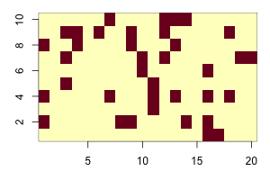
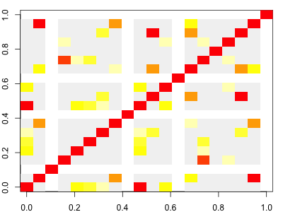
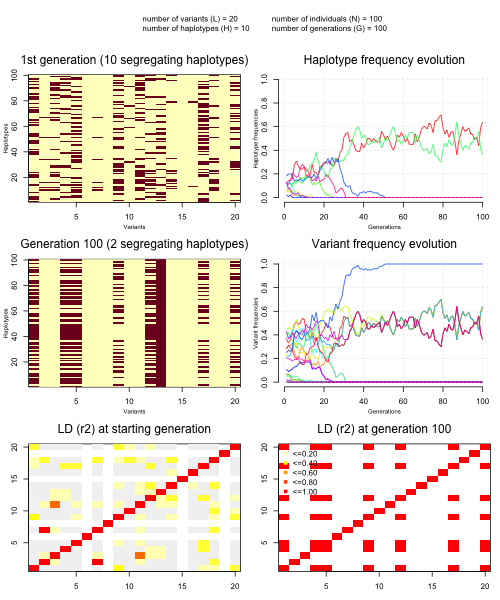

### Implementing a Wright-Fisher model on a finite number of SNPs

The Wright-Fisher model is about the simplest population-genetic model there is.  It consists of:

* A population of *N* individuals (which stays fixed over time).
* non-overlapping generations
* in each generation, each individual 'samples' its parent uniformly from individuals in the parent generation.

It's pretty simple to implement, but even so it turns out to have many of the key features of real populations.  We are going to implement it.

As stated above there isnt really anything about *genetics* in the model.  So to give ourselves some genetic data to work with, we'll also generate a set of haplotypes and have them evolve through the model.

Let's get started.  

#### Generating a starting set of haplotypes

Let's imagine we are looking at set of *L = 20* SNPs to start with and that there are (say) up to 10 different haplotypes in our population at the start of the simulation:

```
L = 20
H = 10
haplotypes = matrix( NA, nrow = H, ncol = L )
```

To generate some simple haplotypes to look at, let's take a simple situation in which the variants are all biallelic (we'll encode the alleles as `0` or `1`), they all start off independent of each other, and they all have 20% frequency.  We can simulate using `rbinom()` like this:
```
haplotypes[,] = rbinom( n = H*L, size = 1, prob = 0.2 )
```

Here's function to make a quick plot of our starting haplotypes:
```
plot.haplotypes <- function( haplotypes ) {
  image(
    t(haplotypes),
    x = 1:ncol(haplotypes),
    y = 1:nrow(haplotypes),
    xlab = "variant",
    ylab = "haplotype"
  )
}
```

If you call it
```
plot.haplotypes( haplotypes )
```
You should see something like this:



#### Generating a population

We will now generate a set of *N* (haploid) individuals each of whom has one of the starting haplotypes.  To keep track of the evolution over *G* generations, let's record these haplotypes in the first row of a matrix:
```
N = 100 # number of individuals
G = 100 # number of generations
population = matrix(
  NA, nrow = G, ncol = N,
  dimnames = list(
    sprintf( "generation=%d", 1:G ),
    sprintf( "individual=%d", 1:N )
  )
)
```
To generate our starting population let's randomly sample our generated haplotypes for the first generation:

```
population[1,] = sample( 1:H, size = N, replace = TRUE )
```

Now we can plot what our population looks like:
```
plot.haplotypes( haplotypes[population[1,],] )
```

Which should show something like this:


#### Evolving the population

In the Wright-Fisher model, in each generation, each individual samples its haplotype from a randomly chosen parent in the generation before.  Let's write a function to generate a new generation given the current one (a row of `population`):
```
evolve <- function( currentGeneration ) {
  parents = sample( 1:N, size = N, replace = TRUE )
  return( currentGeneration[parents] )
}
```

That was pretty easy!  Now we can evolve the population:
```
for( generation in 2:G ) {
  population[generation,] = evolve( population[generation-1,] )
}
```

Look at the result before and after evolution:
```
layout( matrix( 1:2, nrow = 2 ) )
par( mar = c( 3, 3, 1, 1 ))
plot.haplotypes( haplotypes[population[1,],])
plot.haplotypes( haplotypes[population[G,],])
```

**Question.** What features of this do you notice?

**Note.** It might be worth emphasising here that there is nothing going on in our model except
inheritance - i.e. genetic drift.  Any structure that appears is purely due to random inheritance.

#### How frequencies evolve

If you look at the 'before' and 'after' haplotypes, you'll probably see some features:

* many variants are no longer polymorphic - the other alleles have been 'lost' or have 'fixed'
* many of the remaining alleles are either rare or common.

But how do these evolve over time? To see that let's write some quick functions to compute the haplotype and variant frequencies across time:

```
compute.haplotype.frequencies <- function( population, haplotypes ) {
  # We compute the frequency of each variant at each generation
  result = matrix(
    nrow = G,
    ncol = H,
    dimnames = list(
      sprintf( "generation=%d", 1:G ),
      sprintf( "haplotype=%d", 1:H )
    )
  )
  for( i in 1:G ) {
    currentGeneration = population[i,]
    result[i,] = sapply( 1:H, function(h) { length( which( currentGeneration == h )) } ) / N
  }
  return( result )
}
```

And plot them:
```
blank.plot <- function( xlim = c( 0, 1 ), ylim = c( 0, 1 ), xlab = "", ylab = "" ) {
  # this function plots a blank canvas
  plot(
    0, 0,
    col = 'white', # draw points white
    bty = 'n',     # no border
    xaxt = 'n',    # no x axis
    yaxt = 'n',    # no y axis
    xlab = xlab,   # no x axis label
    ylab = ylab,   # no x axis label
    xlim = xlim,
    ylim = ylim
  )
}

frequencies = compute.haplotype.frequencies( population, haplotypes )

blank.plot( xlim = c( 1, G ), ylim = c( 0, 1 ), xlab = "Generations", ylab = "Haplotype frequencies")
palette = rainbow( H )
for( i in 1:H ) {
  points( 1:G, frequencies[,i], col = palette[i], type = 'l' )
}
grid()
axis(1)
axis(2)
```

**Question.** What happens to the haplotype frequencies over time?  What is causing this?

#### How linkage disequilibrium evolves

Because all our SNPs were independent of each other, and all the samples were unrelated, we
wouldn't expect to see any strong linkage disequilibrium (correlation between genotypes at
different variants) at the start of our simulation. Or do we? Let's compute the LD now and see:

```
compute.ld <- function( haplotypes ) {
  cor( haplotypes )
}

compute.ld( haplotypes[population[1,],] )
```

You should get a big 20x20 matrix of correlation values, with ones on the diagonal and lower values between SNPs.  The `image()` function can be used to visualise this.  By default `image()` chooses its own colour set, but we'll specify a fixed set using the `breaks` and `col` arguments:
```

plot.ld <- function( haplotypes ) {
  breaks = c( -0.01, seq( from = 0.1, to = 1, by = 0.1 ))
  ld.colours = c( 'grey95', rev( heat.colors( length(breaks)-2 )))
  r = compute.ld( haplotypes )
  image(
    r^2,
    breaks = breaks,
    col = ld.colours
  )
}
plot.ld( haplotypes[population[1,],])
```

Here we've plotted *r<sup>2</sup>*; the colour scale is set up so *red points* are variants in high LD (also seen on the diagonal); yellow & orange points have intermediate LD; and grey points have *r<sup>2</sup> < 0.1*.  And white points have missing values (which occurs if one or other of the variants was actually monomorphic.)  It should look something like this:



**Note.** As it turns out, even at this starting point in our simulation, there can be a bit of LD.
It arises due to our finite set of starting haplotypes.

Now plot the LD for the final generation and compare to the original:
```
layout( matrix( 1:2, ncol = 1 ))
plot.ld( haplotypes[population[1,],] )
plot.ld( haplotypes[population[G,],] )
```

Depending on your simulation, you *might* see blocks of strong LD appearing.  (Or you might just see lots of white (missing) LD - it depends what happened in the simulation.)

#### Exploring the simulations.

In the file [`simulation_and_visualisation.R`](simulation_and_visualisation.R) I've wrapped up the above code into two key functions:

* `simulate.population()` which simulates from the model as above.
* `plot.simulation()` which makes a multi-panel plot of the result.

To get this code, `source()` it into your session:
```
source( "simulation_and_visualisation.R" )
```

You can run it like this:
```
sim = simulate.population( L = 20, N = 100, G = 100 )
plot.simulation(sim)
```

or on one line:
```
plot.simulation( simulate.population( L = 20, N = 100, G = 100 ) )
```

It produces a plot like this:



**Note.** Remember that *L* is the number of variants, *N* is the population size, and *G* is the number of generations.  (You can also specify *H*, the number of haplotypes we created at the simulation start, if you want to.)

**Question**. Explore the simulations and try varying the parameters.  In particular, try varying the population size *N*.  How does this affect the simulations?

**Question**. Describe in general what happens to haplotypes and variants as the simulations proceed.

**Question**. What does genetic drift do to LD?

#### Population-genetic statistics

Clearly genetic diversity is lost as the random inheritance patterns cause haplotypes to be lost, and others to increase in frequency.  It would be good to measure the amount of diversity and how it gets lost through the simulation.  Two measures of this are:

* The *nucleotide diversity*.  This is the number of genotype differences between two samples, averaged over all pairs of samples in the data.

* The *heterozygosity*.  This is the probability that two individuals carry the same haplotype.

**Challenge question.** Implement these and add them to our plot.

**Note.** A basic facts about population-genetic models like this is as follows. The heterozygosity
is expected to decay at a rate that depends on the sample size:


where *H<sub>1</sub>* is the heterozygosity in the first generation.  In particular, as you will have seen above, diversity is lost at a faster rate in smaller populations.

