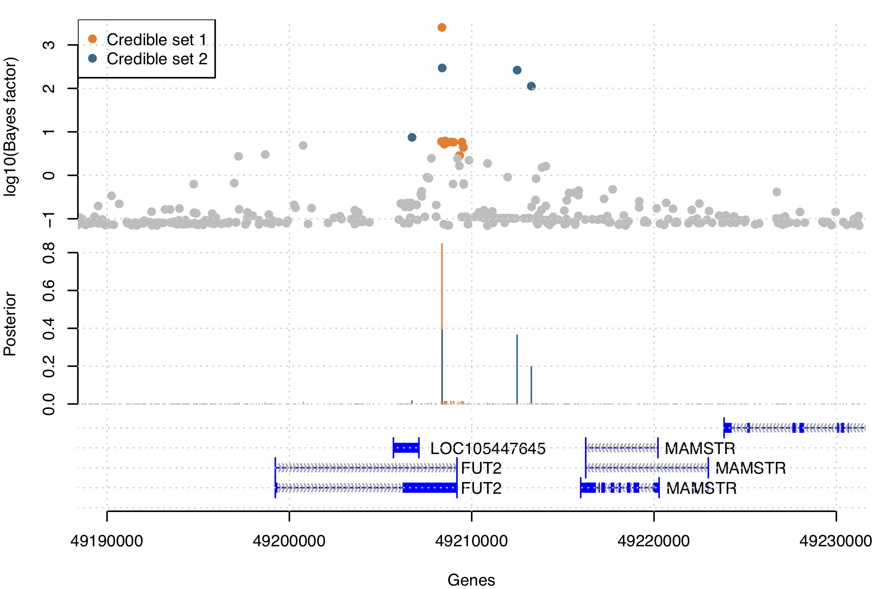

[Up to the table of contents](README.md) - [Back to the meta-analysis section](Meta-analysis.md)

## Using `FINEMAP` to fine-map associations

If you followed the [meta-analysis section](Meta-analysis.md) you should now have a dataframe with meta-analysis results.  It looks something like this:

    > meta_analysis
    # A tibble: 730 x 16
       rsid             chromosome position allele1 allele2 study1.beta study1.se   study1.P log10_study1.BF study2.beta study2.se study2.P meta.beta meta.se   meta.P log10_meta.BF
       <chr>                 <dbl>    <dbl> <chr>   <chr>         <dbl>     <dbl>      <dbl>           <dbl>       <dbl>     <dbl>    <dbl>     <dbl>   <dbl>    <dbl>         <dbl>
     1 19:49149607:G:A          19 49149607 G       A            0.202     0.228  0.376              -0.0925     -0.146      0.295  0.310      0.0176  0.0894 8.44e- 1       -0.0497
     2 19:49149711:G:A          19 49149711 G       A           -0.0183    0.202  0.928               0.0195      0.239      0.261  0.180      0.0245  0.0894 7.84e- 1       -0.0668
     3 19:49149937:T:G          19 49149937 T       G           -0.357     0.0785 0.00000540          4.90       -0.264      0.101  0.00463   -0.669   0.0894 7.45e-14       12.3   
     4 19:49150048:G:T          19 49150048 G       T           -0.332     0.0788 0.0000257           4.26       -0.271      0.102  0.00387   -0.636   0.0894 1.12e-12       11.2   
     5 19:49150130:G:T          19 49150130 G       T           -0.196     0.110  0.0756              0.947      -0.204      0.143  0.0767    -0.209   0.0894 1.96e- 2        1.52  
     6 19:49150233:G:A          19 49150233 G       A            0.133     0.134  0.321              -0.137      -0.0794     0.173  0.323      0.0381  0.0894 6.70e- 1       -0.0958
     7 19:49151312:C:T          19 49151312 C       T            0.238     0.145  0.101              -0.137       0.101      0.187  0.295      0.114   0.0894 2.03e- 1       -0.176 
     8 19:49151323:T:G          19 49151323 T       G            0.202     0.228  0.376              -0.0925     -0.146      0.295  0.310      0.0176  0.0894 8.44e- 1       -0.0497
     9 19:49151460:C:CA         19 49151460 C       CA          -0.283     0.153  0.0636              0.936      -0.218      0.197  0.134     -0.142   0.0894 1.12e- 1        0.830 
    10 19:49152118:C:T          19 49152118 C       T           -0.609     0.328  0.0632              0.634      -0.604      0.423  0.0767    -0.0723  0.0894 4.19e- 1        0.319 

We can look at the strongest signals in the data (either by P-value or Bayes factor) and compare across the studies and the meta-analysis.

However, **what if there are multiple causal variants in the region**?

If there are, then the single-SNP estimate at each SNP we see above would be a combination of several things:

* A contribution from the true, causal effect of the SNP.  (This will be zero if the SNP doesn't have a causal effect)
* A contribution from sampling noise (represented in the standard error)
* A contribution from other causal SNPs that happen to be in linkage disequilibrium (i.e. correlated) with this SNP.

Moreover it is possible that looking at the 'top' SNPs as above could be misleading in this case
(for example, if there were a SNP that is in strong LD with two causal SNPs, it might have an
apparent strong effect.)

In this part of the practical we will use the [`FINEMAP`](https:/www.finemap.me) tool to fit a model that allows for multiple possbile causal SNPs.


### Preparing FINEMAP input files

To run finemap, we need to set up some input files in [the particular format that FINEMAP needs](https:/www.finemap.me).  `FINEMAP` takes:

* A set of per-SNP summary statistics (betas and standard errors) from the study. To maximise
  power, we will use your meta-analysed results here.

* A matrix of between-SNP linkage disquilibrium (correlation) values.

* It also requires us to specify the sample size - in our study the sample sizes were 12,500 (study
  1) and 7,500 (study 2), so the total sample size is 20,000.

We have precomputed the LD values for you in the file [`study_LD.ld`](study_LD.ld). (It is a giant
*730 &times; 730* matrix represented in a text file). But we need to make a file of meta-analysis
results.

If you look at [the documentation](https:/www.finemap.me) you'll see that FINEMAP needs a
space-separated file with these columns: rsid, chromosome, position, allele1, allele2, maf, beta,
se. The only thing we don't have that we need right now is the *minor allele frequency*. So let's
compute this first using the minor allele frequencies from the two studies and their sample sizes
(which in this data are study1: 12,500 and study2: 7,500):

```
meta_analysis$maf = ((study1$maf * 12500) + (study2$maf * 7500)) / (20000)
```

**Note.** The above calculation is **dangerous**: it would be wrong if the minor allele is not the
same in the two studies. For this data we happen to know that is not the case, but in real data you
should always aim to **compute the allele frequency of a specific allele** instead.

Now let's write a FINEMAP input file:

**Still in your R / RStudio session**:
```
finemap.data = meta_analysis[, c( "rsid", "chromosome", "position", "allele1", "allele2", "maf", "meta.beta", "meta.se" )]
colnames( finemap.data )[7:8] = c( "beta", "se" )
write_delim( finemap.data, "combined_study.z", delim = " ")
```

To get `FINEMAP` to run we also have to give it another input file telling it what all the input
and output files are. This one is a bit weird: it is a *semi-colon delimited* text file. Create a
new file called `finemap.master` and put this in:
```
z;ld;snp;config;cred;log;n_samples
combined_study.z;study_LD.ld;finemap_meta.snp;finemap_meta.config;finemap_meta.cred;finemap_meta.log;20000
```

**Note.** The format of the file is [described here](http://www.christianbenner.com/#input). What
input files are we using? What output files have we specified? What's the number `20000`?

Now you are ready to run `FINEMAP`...

### Running `FINEMAP``

I'm going to assume you have downloaded and been able to run `FINEMAP` as described in the
[Introduction](Introduction.md). (If not please go and download it now.) Hopefully you know where
it is and can run it with a command of the following form. (**Note.** in this section we are back
to working on the command-line - these are not R commands!)  Try this:

```
$ /path/to/finemap_v[version]/finemap_v[version]
```

For example, on my older Mac OS system I had to use finemap v1.3, so running it looks like this:

    $ /path/to/finemap_v1.3.1_MacOSX/finemap_v1.3.1_MacOSX 

    |--------------------------------------|
    | Welcome to FINEMAP v1.3.1            |
    |                                      |
    | (c) 2015-2018 University of Helsinki |
    |                                      |
    | Help :                               |
    | - ./finemap --help                   |
    | - www.finemap.me                     |
    | - www.christianbenner.com            |
    |                                      |
    | Contact :                            |
    | - christian.benner@helsinki.fi       |
    | - matti.pirinen@helsinki.fi          |
    |--------------------------------------|
    
    Error : No flags detected!

For ease of use, I suggest to copy the finemap executable into the current directory:
```
cp /path/to/finemap_v[version]/finemap_v[version] ./finemap
```

Running FINEMAP is hopefully now easy:
```
$ ./finemap --sss --in-files finemap.master
``` 

Be prepared for a bit of a wait as FINEMAP searches the space of possible causal configurations.

**Note.** What *is* FINEMAP doing? Well, you can read the [FINEMAP
paper](https://doi.org/10.1093/bioinformatics/btw018), but in short: finemap conducts a *shotgun
stochastic search* around the space of possible causal configurations (groups of SNPs that might be
causal). It starts off with all single-SNP models, then it randomly tries a bunch of ways of adding
a second SNP to the first (picking the best model).  Then it keeps going randomly trying to add or
remove SNPs so that it explores the space of configurations that have high probability.

In general it would need the raw genotype data to do this. However, because it assumes an additive
model (of genotypes on phenotype) it turns out that an approximation based on the SNP effects and
ld is sufficient, which is how FINEMAP can run so fast.

### Interpreting FINEMAP output

Your run of FINEMAP should have produced several output files (the ones you named in your
`finemap.master` file):

* A 'configurations' file (`finemap_meta.config`), listing the causal configurations that FINEMAP thinks are plausible.
* A 'credible intervals' file, (`finemap_meta.cred`) listing variants wiht high probabilty of being the causal SNP for each signal in the top configuration.
* A 'SNP' file (`finemap_meta.snp`), listing the evidence that each SNP is one of the causal ones across configurations
* And a log file (`finemap_meta.log`) telling you what it has done.

Let's look at these files now.

**Note.** If for whatever reason you couldn't get FINEMAP to run, you can use my output files which
are in the [`solutions`](solutions/) folder.

#### The FINEMAP log file.

Before you look at the output files, look at the results FINEMAP prints to stdout when you run it
(and saves to the .log_sss file). Mine looks like this:

    
    |--------------------------------------|
    | Welcome to FINEMAP v1.3.1            |
    |                                      |
    | (c) 2015-2018 University of Helsinki |
    |                                      |
    | Help :                               |
    | - ./finemap --help                   |
    | - www.finemap.me                     |
    | - www.christianbenner.com            |
    |                                      |
    | Contact:                             |
    | - christian.benner@helsinki.fi       |
    | - matti.pirinen@helsinki.fi          |
    |--------------------------------------|
    
    --------
    SETTINGS
    --------
    - dataset         : all
    - corr-config     : 0.95
    - n-causal-snps   : 5
    - n-configs-top   : 50000
    - n-convergence   : 1000
    - n-iterations    : 100000
    - prior-k0        : 0
    - prior-std       : 0.05 
    - prob-tol        : 0.001
    
    ------------
    FINE-MAPPING (1/1)
    ------------
    - GWAS summary stats               : combined_study.z
    - SNP correlations                 : study_LD.ld
    - Causal SNP stats                 : finemap_meta.snp
    - Causal configurations            : finemap_meta.config
    - Credible sets                    : finemap_meta.cred
    - Log file                         : finemap_meta.log_sss
    
    - Number of GWAS samples           : 20000
    - Number of SNPs                   : 730
    - Prior-Pr(# of causal SNPs is k)  : 
      (0 -> 0)
       1 -> 0.583
       2 -> 0.291
       3 -> 0.097
       4 -> 0.0242
       5 -> 0.00482
    - 757559 configurations evaluated (1.152/100%) : converged after 1152 iterations
    - Regional SNP heritability        : 0.00486 (SD: 0.000961 ; 95% CI: [0.00316,0.00689])
    - Log10-BF of >= one causal SNP    : 14.3
    - Post-Pr(# of causal SNPs is k)   : 
      (0 -> 0)
       1 -> 0.00308
       2 -> 0.923
       3 -> 0.074
       4 -> 0.000159
       5 -> 0
    - Run time                         : 0 hours, 0 minutes, 18 seconds

There are two bits of information here that allow you to interpret the fine-mapping: the overall
Bayes factor for the region, and the posterior distribution on the number of variants.

First, look at the line starting "Log10-BF of >= one causal SNP". This tells us the overall Bayes
factor (i.e. the Bayes factor that there is at least one causal variant in the region).

    Log10-BF of >= one causal SNP : 14.3

This Bayes factor is very large (over 10<sup>14</sup>), and shows that FINEMAP sees clear evidence that there is signal in
the region. (This is not surprising, of course, because we started with a region of strong
association.)

Second, let's look at the posterior distribution on the number of causal variants. These occur at
the end of the log file on these lines:

    - Post-Pr(# of causal SNPs is k)   : 
      (0 -> 0)
       1 -> 0.00308
       2 -> 0.923
       3 -> 0.074
       4 -> 0.000159
       5 -> 0

FINEMAP is certain that there are at least two causal variants (as the posterior of k=1, i.e. there
being one variant is very small). And it quite strongly believes (92% posterior) that k = 2, i.e.
that there are exactly two causal variants.

#### The causal configurations output file

Let's look next at the `finemap_meta.config` file, which list gives the best 50,000 causal
configurations that FINEMAP found in its stochastic search. Load this file into your R session now:

```
configurations = read_delim( "finemap_meta.config", delim = " " )
```

We will look at the ones that have at least a 10% posterior:

```
configurations[ configurations$prob > 0.1, ]
```

**Note.** To print the full details here without truncating columns, I found I had to use `print()`
like this:

```
print( configurations[ configurations$prob > 0.1, ], width = 100 )
````

As we would expect from the posterior distribution on `k`, all of the higher posterior
configurations include just two variants. In fact all three of them include the variant at position
`49208368`, but they vary a bit by swapping out the second variant in the pair. Note also that the
sum of the posterior for three causal configurations is only 64%, so while these are the most
likely it is also perfectly plausible that the true configuration lies somewhere further down the
list.

The configuration files can be a bit hard to interpret (and are mostly useful as input for
downstream analyses), so we will move on to some slightly easier files to read.

#### The SNP file

FINEMAP also outputs the evidence for each individual SNP being causal (regardless of the
configuration).  Let's see how many SNPs have an posterior greater than 10%:

```
snps = read_delim( "finemap_meta.snp", delim = " " )
print( snps[ snps$prob > 0.1, ], width = 100 )
```

The SNP at position `49208368` has a high posterior (85%), so is quite likely to be causal and you
would be quite confident taking this forward for follow-up experiments or further analyses. The
other variants have posteriors between 19% and 40%, so are reasonable candidates but you wouldn't
bet the house on any one individually. Instead, if you were designing follow-up experiments based
on this, you would need to consider these variants as a group.

#### The credible sets file

To group variants, FINEMAP also provides credible sets for each of the two signals:

```
credible = read_delim( "finemap_meta.cred", delim = " " )
print( credible, width = 100 )
```

Also make sure look at the column names:
```
> 
colnames( credible )
[1] "index" "cred_set_19:49208368:C:T" "prob_set_19:49208368:C:T" "cred_set_19:49208380:T:C" "prob_set_19:49208380:T:C"
```

**Note.** My version of the file has trailing spaces at the end of each line - so R warns about
missing column names when I load it.  You can safely ignore that.

The data in this file shows:

* that the signal that contains the variant at `49208368` has a credible set size of 12 variants
  (the possible variants are listed in the 2nd column).

* and also that the signal that includes the variant at 49208380 has a credible set size of 4
  variants (listed in the 4th column).

This illustrates a counter-intuitive point: even though 49208368 itself has a high posterior, it is
in LD with a "long tail" of 11 other variants that are in tight LD with each other. The signal that
includes 49208380 is not well fine-mapped to a single causal variant, but it does localize well to
a small number of variants (4). So, if you are looking for a single variant that is reasonably
likely to be causal, you'd pick 49208368. But if you were looking for a small set of variants that,
overall, cover most of the possible causal posterior space, you would pick the second signal.

*Question* Using genome browsers, investigate the location and function of these variants. Based on
the genetic and the functional information, which variant do you think is most likely to be cauasal
in each group?

### Plotting FINEMAP output.

In statistics we are never done until the ink is dry on our plot. Let's make a hitplot that (like
our GWAS practical hitplot) shows the marginal evidence at each SNP, but colours the SNPs according
to what credible set they fall in.  

First we have to reconstruct the marginal SNP P-value from the effect size and standard error (or z-score),
since FINEMAP doesn't output the P-value:

```
snps$pvalue = 2 * pnorm( -abs(snps$z ))
```

Next let's define the colours for our credible sets:

```
colours = c( "chocolate1", "deepskyblue4" )
snps$colour <- "grey"
snps$colour[ snps$rsid %in% credible[['cred_set_19:49208368:C:T' ]] ] <- colours[1]
snps$colour[ snps$rsid %in% credible[['cred_set_19:49208380:T:C' ]] ] <- colours[2]
```

Also let's load genes using the same data / code from the [GWAS
practical](../GWAS_analysis_practical):

```
genes <- read.table( "resources/refGene_chr19.txt.gz", header=T, as.is=T )
```

Now here's a function that makes the plot:

```
plot.finemap.output <- function( snps, credible, xrange = NULL ) {
  # Two big panels and a small one for genes
  layout( matrix( 1:3, ncol = 1 ), heights = c( 1, 0.75, 0.75 ))

  if( is.null( xrange )) {
    xrange = range( snps$position )
  }
  # Plot the per-SNP evidence
  par( mar = c( 0.1, 4, 1, 1 ))
  plot(
    snps$position,
    -log10( snps$pvalue ),
    xlab = "Position",
    ylab = "log10(Bayes factor)",
    col = snps$colour,
    pch = 19,
    xaxt = 'n',
    xlim = xrange,
    bty = 'n'            # no box, because I think they're ugly!
  )
  grid()
  legend( "topleft", col = colours, pch = 19, legend = sprintf( "Credible set %d", 1:2 ))

  # Plot the posteriors
  par( mar = c( 0.1, 4, 0.1, 1 ))
  plot(
    snps$position,
    snps$prob,
    ylab = "Posterior",
    col = snps$colour,
    type = "h",          # to plot vertical lines.  See `?plot`.
    xlim = xrange,
    xaxt = 'n',
    bty = 'n'            # no box
  )
  grid()

  par( mar = c( 4, 4, 0.1, 1 ))
  plot.genes( genes, xrange, bty = 'n' )
  grid()
}
```

Run it like this:

```
plot.finemap.output( snps, credible )
```

and inspect it.  You can also zoom in to see how the evidence stacks up over the genes:
```
plot.finemap.output( snps, credible, xrange = c( 49190000, 49229999 ) )
```

It should look something like this:



At this point you can adjust the function to plot `-log10(snps$pvalue)` instead.

