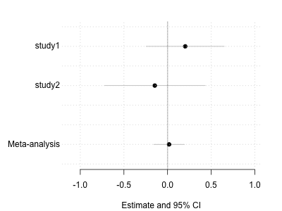

[Up to the table of contents](README.md) - [Back to the Introduction](Introduction.md) - [Forward to the fine-mapping section](Fine-mapping.md)

### Meta-analysing two studies.

#### Conducting fixed-effect meta-analysis
The simplest way to perform meta-analysis is as follows.  We assume:

* that the *true effect* is the same in both studies.
* that the *observed effect* in each study is equal to the *true effect* plus noise.  (The noise is given by the study standard error, and is assumed to be gaussian in the usual way.)

The full name of this is *inverse variance weighted fixed-effect meta-analysis*.  

Here's how it works: form a weighted average of the effect estimates, weighted by the inverse of the variances:


Compute also the sum of weights:


Then the *meta-analysis estimate* is


and the *meta-analysis standard error* is


**Note.** There are two good reasons to compute the estimate this way. Firstly, [normal times
normal is
normal](../../Statistical_modelling/Introduction/notes/Normal%20times%20normal%20is%20normal.pdf) -
and if you figure it out, you'll see the above calculation is the same as that lemma.

Secondly, it makes sense: the meta-analysis estimate is a weighted average of the per-study
estimates, and they are weighted by the variance: studies with lots of uncertainty (large variance)
get weighted down while studies with little uncertainty (small variance) get higher weight.

### Running the meta-analsis

Here is a function to run the meta-analysis from our two studies:
```
meta.analyse <- function( beta1, se1, beta2, se2 ) {
  inverse.variances = c( 1/se1^2, 1/se2^2 )
  b = c( beta1, beta2 ) * inverse.variances
  meta.inverse.variance = sum( weights )
  meta.beta = sum( b ) / meta.inverse.variance
  meta.se = sqrt( 1 / meta.inverse.variance )
  
  # This formulation computes a two-tailed P-value
  # as discussed in lectures
  meta.P = pnorm( -abs( meta.beta ), sd = meta.se ) * 2
  
  # This formulation computes a Bayes factor under a N(0,0.2^2) prior
  meta.BF = (
    pnorm( meta.beta, mean = 0, sd = sqrt( meta.se^2 + 0.2 ) ) /
    pnorm( meta.beta, mean = 0, sd = meta.se )
  )

  return( list(
    meta.beta = meta.beta,
    meta.se = meta.se,
    meta.P = meta.P,
    log10_meta.BF = log10( meta.BF )
  ))
}
```

Try it on some fake data, for example:
```
> meta.analyse( beta1 = 1, se1 = 0.1, beta2 = 1, se2 = 0.1 )
```

Try a few different input values.  You should see:

* The *meta-analysis estimate* should be somewhere between the two input estimates.
* The *meta-analysis standard error* should be smaller than either of the two study standard errors.
* The *meta-analysis P-value* depends on how well the two estimates 'stack up' on each other.  If they are both in the same direction and of roughly comparable size, the P-value will be lower than either of the study P-values.

Here is a way to run the above function across all the data in our study.

**Note.** We will use the [`purrr`](https://purrr.tidyverse.org) function `map_dfr()` to run the
above function across all rows and return a data frame. If you don't have `purrr`, you could use a
base R function like `lapply()` instead.

```
meta_analysis = map_dfr(
  1:nrow(study1),
  function( i ) {
    c(
      rsid = study1$rsid[i],
      chromosome = study1$chromosome[i],
      position = study1$position[i],
      allele1 = study1$allele1[i],
      allele2 = study1$allele2[i],
      study1.beta = study1$beta[i],
      study1.se = study1$se[i],
      study1.P = study1$P[i],
      log10_study1.BF = study1$log10_BF[i],
      study2.beta = study2$beta[i],
      study2.se = study2$se[i],
      study2.P = study2$P[i],
      log10_study2.BF = study2$log10_BF[i],
      meta.analyse(
        study1$beta[i], study1$se[i],
        study2$beta[i], study2$se[i]
      )
    )
  }
)
```

**Question.** What does the meta-analysis look like for the 'top' SNPs (e.g. those with the lowest
P-values or highest Bayes factors) in study1 or 2? Is the evidence stronger or weaker across
studies? Has the meta-analysis changed the SNP or SNPs with the strongest evidence? Why?

**Hint.** One way to pull out the 'top' SNps is to use the `order()` function. For example to pull
out the results for the ten SNPs with the lowest P-values in study 1, in order:

```
meta_analysis[ order( meta_analysis$study1.P )[1:10], ]
```

### Making a forest plot

To make best sense of this the tool for the job is a [*forest plot*](https://en.wikipedia.org/wiki/Forest_plot).  We plot the study estimates and the meta-analysis estimate, along with their confidence/credible intervals, on seperate lines.  Let's do that now.  First here's our utility function to make a blank canvas:

```
blank.plot <- function( xlim = c( 0, 1 ), ylim = c( 0, 1 ), xlab = "", ylab = "" ) {
  # this function plots a blank canvas
  plot(
    0, 0,
    col = 'white', # draw points white
    bty = 'n',     # no border
    xaxt = 'n',    # no x axis
    yaxt = 'n',    # no y axis
    xlab = xlab,   # no x axis label
    ylab = ylab,   # no x axis label
    xlim = xlim,
    ylim = ylim
  )
}
```

Now let's make a general forest plot function:
```

draw.forest.plot <- function(
  betas,
  ses,
  names
) {
  # y axis locations for the lines.
  # We assume the meta-analysis will go on the last line, so we separate it slightly by putting it at 1/2
  y = c( length(betas):2, 0.5 )
  
  # learn a good x axis range by going out 3 standard errors from each estimate:
  xlim = c( min( betas - 3 * ses ), max( betas + 3 * ses ))
  # Also let's make sure to include zero in our range
  xlim[1] = min( xlim[1], 0 )
  xlim[2] = max( xlim[2], 0 )

  # expand the range slightly
  xcentre = mean(xlim)
  xlim[1] = xcentre + (xlim[1] - xcentre) * 1.1
  xlim[2] = xcentre + (xlim[2] - xcentre) * 1.1

  # Give ourselves a big left margin for the row labels
  par( mar = c( 4.1, 6.1, 2.1, 2.1 ))
  blank.plot(
    xlim = xlim,
    ylim = c( range(y) + c( -0.5, 0.5 )),
    xlab = "Estimate and 95% CI"
  )
  
  # Draw the intervals first so they don't draw over the points
  segments(
    x0 = betas - 1.96 * ses, x1 = betas + 1.96 * ses,
    y0 = y, y1 = y,
    col = 'grey'
  )

  # Now plot the estimates
  points(
    x = betas,
    y = y,
    col = 'black',
    pch = 19
  )

  # ... and add labels.  We put them 10% further left than the leftmost point
  # and we right-align them
  text.x = xcentre + (xlim[1] - xcentre) * 1.1
  text(
    x = text.x,
    y = y,
    labels = names,
    adj = 1, # right-adjust
    xpd = NA # this means "Allow text outside the plot area"
  )
  
  # Add an x axis
  axis( 1 )
  
  # add grid lines
  grid()
  
  # add a solid line at 0
  abline( v = 0, col = rgb( 0, 0, 0, 0.2 ), lwd = 2 )
}
```

For example, we could now make a forest plot for the first SNP:
```
  forest.plot <- function( row ) {
    betas = c( row$study1.beta, row$study2.beta, row$meta.beta )
    ses = c( row$study1.se, row$study2.se, row$meta.se )
    names = c( "Study 1", "Study 2", "Meta-analysis" )
    draw.forest.plot( betas, ses, names )
  }
  
  forest.plot( meta_analysis[1,] )
```



**Question.** What does the forest plot look like for the 'top' SNPs, i.e. for those with the lowest P-values (or highest Bayes factors)?  Plot a few of them and look at them.  Make sure you understand how the data in the meta-analysis file corresponds to the data on the plot.

**Note.** Forest plots are deceptively simple - they don't look like there's much going on, but whenever I try to draw one I find it takes quite a bit of code.  (Like the `draw.forest.plot()` function above, which already has ~40 lines of code).  This is typical of visualisation in general - the code always gets lengthy - and I think it is not really surprising.  It is because in a visualistion you are trying to convey a great deal of information clearly in a small space: this often takes great deal of careful tweaking to get right.  Don't skimp on this!

**Challenge.** For a "working" plot, one thing it might be good to add to the plot would be more text listing the numerical values (i.e. the estimate and 95% confidence intervals)  E.g. this code:

```
labels = sprintf(
  "%.2f (%.2f - %.2f)",
  betas,
  betas - 1.96 * ses,
  betas + 1.96 * ses
)
```
produces the right kind of text.  Then you can add it to the plot in the right place.

### Fine-mapping the association

By now you should have a good sense of which SNPs have lots of evidence for association in the two studies - and maybe these are the 'causal' SNPs.  However, an obvious possibility (if the gene is relevant for the disease) is that there could be multiple causal SNPs.  In the [next section](Fine-mapping.md) we will see one way to try to discover how many causal SNPs there are - and what they are.
