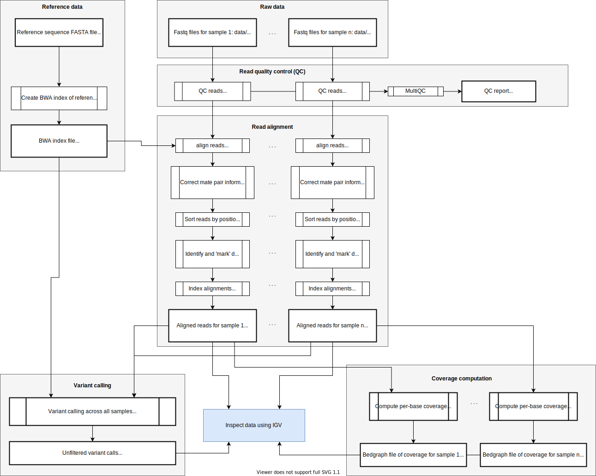

## Implementing a NGS data processing pipeline.

If you've followed the [introduction](Introduction.md), you should now have a bunch of software installed,
including the `snakemake` pipelining software, and you will have a set of 10 fastq files named in
the format `ERR[xxxxxx]_[1|2].fastq.gz`.  And you will also have downloaded the *P.falciparum* reference sequence, `Pf3D7_v3.fa.gz` - we recommend putting this in its own folder, say `data/reference/`.

**Challenge.**  Write a snakemake pipeline that processes these reads.  Here are some points to consider.

* Your pipeline should start with the set of fastq read files named by accessions as described in the [introduction](Introduction.md).  To keep things well-organised, it's a good idea to keep these in a subdirectory, so they will look something like this:

```
   data/reads/ERR377582_1.fastq.gz
   data/reads/ERR377582_2.fastq.gz
   data/reads/ERR377591_1.fastq.gz
   data/reads/ERR377591_2.fastq.gz
   data/reads/ERR377629_1.fastq.gz
   data/reads/ERR377629_2.fastq.gz
   data/reads/ERR417621_1.fastq.gz
   data/reads/ERR417621_2.fastq.gz
   data/reads/ERR417627_1.fastq.gz
   data/reads/ERR417627_2.fastq.gz
```

* You will also need the reference sequence, placed in `data/reference/Pf3D7_v3.fa.gz`.

* The pipelines will output a set of BAM files containing these reads aligned to the a reference sequence.  The reads should be coordinate sorted, duplicate read pairs should have been marked (or removed), and the reads should be indexed.  My advice is to put results in a seperate subdirectory, so they will look something like this:

```
    results/aligned/QG0033-C.bam
    results/aligned/QG0033-C.bam.bai
    results/aligned/QG0041-C.bam
    results/aligned/QG0041-C.bam.bai
    results/aligned/QG0049-C.bam
    results/aligned/QG0049-C.bam.bai
    results/aligned/QG0056-C.bam
    results/aligned/QG0056-C.bam.bai
    results/aligned/QG0088-C.bam
    results/aligned/QG0088-C.bam.bai
```

* The pipeline should also perform QC of the fastq files. We suggest using `fastqc` and `multiqc` for this.
  So this will output some files that look like this:

```
    results/qc/QG0033-C.fastqc.html
    results/qc/QG0041-C.fastqc.html
    results/qc/QG0049-C.fastqc.html
    results/qc/QG0056-C.fastqc.html
    results/qc/QG0088-C.fastqc.html
    results/qc/multiqc_report.html
```
You should of course look at the output to look for anything odd!

* The pipeline will also output a [`bedgraph`](http://genome.ucsc.edu/goldenPath/help/bedgraph.html) file for each sample, reporting the coverage at each site in the genome.  (`bedtools genomecov -bg` is a good way to create this).  These will look like this:

```
    results/coverage/QG0033-C.coverage.bedgraph
    results/coverage/QG0041-C.coverage.bedgraph
    results/coverage/QG0049-C.coverage.bedgraph
    results/coverage/QG0056-C.coverage.bedgraph
    results/coverage/QG0088-C.coverage.bedgraph
```

* And, if you implement the whole pipeline, it will also output a variant calls file (for this tutorial we suggest using the [`octopus` variant caller](https://github.com/luntergroup/octopus) for this).  These will be an indexed bgzipped [vcf file](https://samtools.github.io/hts-specs/VCFv4.2.pdf), which should look like this:

```
    results/variant_calls/variant_calls.vcf.gz
    results/variant_calls/variant_calls.vcf.gz.tbi
```

Here is a diagram of the overall pipeline:



You have to implement the green bits... good luck!

If you are running this as part of a [WHG course](www.well.ox.ac.uk), we'll discuss your pipeline and look at the outputs at the wrap-up session later in the week.

### Tips and tricks

Here is some guidance to help you write your pipeline.  Click the links to jump to the relevant section.

* [How should I put sample information in?](#How-should-I-put-sample-information-in)
* [How should I organise my pipeline files?](#How-should-I-organise-my-pipeline-files)
* [My snakefiles are getting too big!](#My-snakefiles-are-getting-too-big)
* [Keeping a fast iteration time during development](#Keeping-a-fast-iteration-time-during-development).
* [Dealing with intermediate files](#Dealing-with-intermediate-files).
* [Read groups what now?](#Read-groups-what-now)
* [What's in the fastq header?](#Whats-in-the-fastq-header)
* [Octopus is taking too long!](#octopus-is-taking-too-long)

#### How should I put sample information in?

I always put the information about the samples / the needed data in through a **config file**. This
is a file called (say) `config.json` that you pass in using the `--configfile` argument.  For example, for this project the `config.json` might look like this:

```
{
	"reference": "data/reference/Pf3D7_v3.fa.gz",
	"fastq_filename_template": "data/reads/subsampled/{id}_{read}.fastq.gz",
	"samples": [
		{ "name": "QG0033-C", "ID": "ERR377582" },
		{ "name": "QG0041-C", "ID": "ERR377591" },
		{ "name": "QG0049-C", "ID": "ERR417627" },
		{ "name": "QG0056-C", "ID": "ERR417621" },
		{ "name": "QG0088-C", "ID": "ERR377629" }
	]
}
```

And I would run snakemake like this:
```
snakemake -s pipelines/master.snakefile --configfile config.json
```

The point of this is that it makes it easy to run the pipeline on different sets of data - you just swap out the config file for a different one.

[Go back to the tips and tricks](#Tips-and-tricks).

#### How should I organise my pipeline files?

I stick to a specific hierarchy: data goes in the `data/` folder, analysis results go in the
`results` folder, and snakemake files and other scripts go in a dedicated `pipelines` folder.  So it might look something like this:

```
toplevel/
  config.json
  pipelines/
    master.snakemake
  data/
    reads/
      ERR377582_1.fastq.gz
      ERR377582_2.fastq.gz
      ...
  results/
    qc/
    aligned/
    ...
```

I then always run the pipeline from the top-level folder. All the paths used in the pipeline are
either *relative to the top-level folder*, or are specified in the config file.

The point of this arrangement is that the `pipelines` folder contains all of the code for the pipeline, but none of the data. This means it is easy to copy around, or to put it up on github, and so on.

**Note.** The snakemake documentation suggests a [similar, but slightly different layout](https://snakemake.readthedocs.io/en/stable/snakefiles/deployment.html).

[Go back to the tips and tricks](#Tips-and-tricks).

#### My snakefiles are getting too big!

To fix this, I often use the snakemake [`include`
feature](https://snakemake.readthedocs.io/en/stable/snakefiles/modularization.html) to split up the
file into components of related rules. For example, in our pipeline there are a bunch of rules for
read qc, some for alignment and post-processing, a bunch for variant calling, and a bunch for
computing coverage and so on. So I might have: ``` pipelines/ master.snakmake functions.snakemake
qc.snakemake alignment.snakemake variants.snakemake coverage.snakemake ```

My `master.snakemake` then looks like this:

```
include: "functions.snakemake"
include: "qc.snakemake"
include: "alignment.snakemake"
include: "variants.snakemake"
include: "coverage.snakemake"
```

I like this because it keeps related things together, but the files become manageable in size.

**Note.** You'll notice I included a `functions.snakemake` above.  This is because you often need a few python functions to help with your pipeline - for example, mapping from sample names to fastq filenames and so on.  They tend to be re-used so it can be nice to group these into one file.

[Go back to the tips and tricks](#Tips-and-tricks).

#### Keeping a fast iteration time during development.

When you're developing a pipeline, you don't want to wait two hours only to discover that it didn't
work. A good idea would therefore be to develop your practical using smaller, sub-sampled version
of the datasets (whichever of the above raw data you use). For example, you could run:

```
$ gunzip -c filename.fastq.gz | head -n 4000 | gzip -c > filename.subsampled.fastq
```

to take the first few reads from each file.

**Question.** The above command specifies a multiple of 4 lines.  Why?  How many reads does the above command extract?

If you set your pipeline up the way I suggest above then you can have a config file for the small
test dataset, and then once it is all working, rerun using the real config file specifying the full
dataset.

[Go back to the tips and tricks](#Tips-and-tricks).

#### Dealing with intermediate files

The alignment steps in [our pipeline](pipeline.svg) in particular are notorious for generating intermediate files.  Indeed:

* the alignment step outputs a SAM file...
* which is converted to a BAM file...
* which you then have to sort by position...
* in which you then have to mark the duplicates...
* which are then indexed.

That's at least 3 intermediate files along the way.  We don't want to keep these, they were just needed during the pipeline.

I use a few ways to deal with this.  One way is just to use unix pipes to pipe command together within rules - as in

```
bwa mem reference.fa read1.fq read2.fq | samtools view -b -o aligned.bam
```

However, I find that too much of this makes the pipeline hard to debug (which command failed?  you can't tell.)

Instead, I typically go for temp files and use the snakemake `temp()` function to tell snakemake files are temporary.  So I might write the alignment rule as:
```
rule align_reads:
  input:
    fq1 = something,
    fq2 = something
  output:
    sam = temp( "results/alignment/{sample_name}.sam" )
  shell: "bwa mem ..."
```
As you can see, I tend to also put temporary files into their own `tmp/` folder as well - this avoids cluttering up the results folder when jobs fail.

Second, rules can refer to other rule outputs, so the next step in the pipeline can be written:
```
rule fix_matepair_information_and_convert_to_bam:
  input:
    sam = rules.align_reads.output.sam
  output:
    bam = temp( "results/alignment/tmp/{sample_name}.bam" )
  shell: "samtools fixmate -m {input.sam} {output.bam}"
```
and so on down the pipeline.

Third - `snakemake` actually has a [named pipe
output](https://snakemake.readthedocs.io/en/stable/snakefiles/rules.html#piped-output) feature, so
you can get the benefit of the UNIX pipe with the same syntax as above - just replace `temp()` with
`pipe()` and it should automatically work. (I've never actually used this feature but it's a nice
idea for this step, because the SAM file output by `bwa` might be huge when applied to real data.)

[Go back to the tips and tricks](#Tips-and-tricks).

#### Read groups what now?

Some programs require reads to have 'read groups'. What are they and how do you get them in there?

BAM files can easily be post-processed and merged.  Read groups are a way to put information in that records the original sample and the sequencing run, so that downstream programs can distinguish these.  The read groups are encoded in the `@RG` header field of the BAM file (which you can see using `samtools view -h`), and in the `RG` tag for each alignment.  A good document on read groups is [this one on the GATK website](https://gatk.broadinstitute.org/hc/en-us/articles/360035890671-Read-groups).

In our pipeline these don't seem that important (we have one alignment file per input fastq file
pair), but in other pipelines the same sample might have been sequenced many times and the results
merged. So for sensible downstream analysis it would be important to keep track of the originating
samples. In particular, variant callers like `octopus` require you to have read groups in the BAM
file.

The simplest way to put read groups into the BAM file is to have `bwa` put them in at the alignment
step.  For our experiment this can be done using the `-R` option like so:
```
bwa mem -R "@RG\tID:ERR377582\tSM:QG0033-C\tPL:ILLUMINA" [other arguments]
```

You can put other stuff into a read group (see below), but the run ID, the sample name, and the platform are all that we need just now.

Of course you have to be able to generate this for each sample.  With the layout described above, I wrote the following code (which I put in `pipelines/functions.snakemake`) to do it:
```
def find_sample_with_ID( ID ):
	samples = config['samples']
	sample = [ sample for sample in samples if sample['ID'] == ID ]
	if  len( sample ) != 1:
		raise Exception( "Wrong number of samples found with ID '%s' (%d, expected 1)." % ( ID, len( sample )) )
	return sample[0]

def get_read_group_line( ID ):
	sample = find_sample_with_ID( ID )
	return "@RG\\tID:{ID}\\tSM:{sample}\\tPL:ILLUMINA".format(
		ID = sample['ID'],
		sample = sample['name']
	)
```

The alignment step can then be updated to use this function:
```
rule align_reads:
  input:
    fq1 = something,
    fq2 = something
  output:
    sam = temp( "results/alignment/{ID}.sam" )
  params:
    read_group_spec = lambda wildcards: get_read_group_line( wildcards.ID )
  shell: """
    bwa mem -R {params.read_group_spec} ...
  """
```

If you look at the resulting files, they have an `@RG` header record and `RG` tags for each read - octopus will then accept these files.

What else can go in a read group? As the [GATK documentation
indicates](https://gatk.broadinstitute.org/hc/en-us/articles/360035890671-Read-groups) the read
group can also contain information about the sequencing flowcell, lane, and sample barcode, and an
identifier for the library itself. Unfortunately some of this information can be hard to come by
depending on where your reads come from. As we describe below, some of it can be obtained from the
read names in the fastq files. For the data in this practical, some parts such as the library
identifier can be found on the [ENA website](ERR377582). But in general it's a bit hard to put it
all together. (Luckily just the sample name and identifier are enough for our analysis.)

[Go back to the tips and tricks](#Tips-and-tricks).

#### What's in the fastq header?

If you look at the header / read name rows of a fastq file you'll see they actually contain a bunch
of information - like this:

```
@ERR377582.7615542 HS23_10792:2:2307:6524:31920#15/1
```

This row tells us the sample ID (`ERR377582`) and the read identifier (`7615542`). And this is
followed by information identifying the instrument that generated the reads (`HS23_10792`), the
flowcell lane and tile number in the lane (`2:2307`), the coordinates of the
[cluster](https://www.broadinstitute.org/files/shared/illuminavids/clusterGenSlides.pdf) within the
tile (`6524`, `31920`), a number identifying the index of the sample within a multiplexed set of
samples (i.e. all run at the same time; `#15`), and whether it's read 1 or 2.

Some of this info can be put in the read group as well.

**Note.** The format of this information is not standard across platforms, and it changes depending
on your data provider. Some other examples can be found [on
wikipedia](https://en.wikipedia.org/wiki/FASTQ_format#Illumina_sequence_identifiers) or on the
[GATK read groups page](https://gatk.broadinstitute.org/hc/en-us/articles/360035890671-Read-groups).

[Go back to the tips and tricks](#Tips-and-tricks).

#### Octopus is taking too long!

The [Octopus variant caller](https://github.com/luntergroup/octopus) can take a long time to do its work - hopefully reflecting that it is trying its best to make high-quality variant calls.  This might take too long to run on your laptop.  If so, here are some options for speeding it up:

* If you have a multi-core CPU, you can use more threads (`--threads` argument).

* Restrict to a set of regions.  You can add the `--regions` option to tell Octopus to only work on specified regions.  For this tutorial, please include these regions: `--regions Pf3D7_02_v3:616190-656190 Pf3D7_02_v3:779288-859288 Pf3D7_11_v3:1023035-1081305`.

* You could also try the Octopus 'fast' or 'very fast' modes - though I haven't tried this.

See `octopus --help` for a full list of options.

(In general this might be less of a problem for real work as you might run it a compute cluster.)

[Go back to the tips and tricks](#Tips-and-tricks).


## Good luck!

