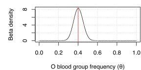

## The frequency of O blood group

In this section we will estimate the frequency of O blood group (as encoded by the [common
loss-of-function deletion in the ABO
gene](https://www.ensembl.org/Homo_sapiens/Variation/Explore?v=rs8176719), in multiple populations.

### An aside on the ABO blood group system.

The ABO blood group system was the first genetic polymorphism discovered in humans - [long before
the structure of DNA was solved](https://www.ncbi.nlm.nih.gov/books/NBK2267/). It was discovered by
studying agglutination patterns of red cells in serum from other individuals and is of course of
extreme relevance to blood transfusion. Beyond this, however, ABO is an interesting gene; the A/B
split seems to have been preserved [under balancing
selection](https://www.pnas.org/content/109/45/18493) across primates, while the O mutation itself
may be a recurrent polymorphism. ABO is also [one of the most pleiotropic loci in the human
genome](https://www.ncbi.nlm.nih.gov/pmc/articles/PMC5207801/) and there is evidence it is
[associated with risk of SARS-CoV-2
infection](https://www.ncbi.nlm.nih.gov/pmc/articles/PMC7594382/). 

But I was interested because it is also [protective against
malaria](https://www.nature.com/articles/s41467-019-13480-z). (The data here comes from that paper).

### Loading the data
First, let's load the data.

**Note.** I am using the [tidyverse](https://www.tidyverse.org) for these examples. If you don't
have it installed, either install it or use base R (e.g. `read.csv()`) instead.

```
library( tidyverse )
data = read_csv( "o_bld_grp.csv" )
```

**Question**.  What countries are in the data?  What ethnic groups?

The O blood group data is in the column called `O.bld.grp`. A `1` in this column means the
individual has O blood group (which happens if they have two copies of the above rs8176719
deletion). A `0` generally means they will have either A, AB, or B blood group depending on the
alleles they carry. (There are actually a few other mutations that cause loss of function of `ABO`,
but we're ignoring them here.)

**Question**. Table this data for each population or ethnicity. Can you estimate the frequency in
each population? In each ethnic group?


### Building a model

You probably estimated the allele frequency as: the number of O individuals divided by the total
number of individuals.  If so, good work!

**Question.** Do you trust these estimates? How much? Do you trust your estimates for all the populations the same
amount? Why?

In this course we are all about handling uncertainty. What we want to do is, not just generate a point estimate of the
frequency, but also quantify the uncertainty we have about it.

To do this let's focus on a single population first - say Tanzania:

```
w = which( data$country == "Tanzania" )
> table( data$country[w], data$O.bld.grp[w] )
          
            0  1
  Tanzania 61 41
```

Counts like this can be modelled well using a [binomial distribution](../../notes/Distributions%20cheatsheet.pdf).

**Question**. Suppose we use a binomial distribution to model these counts.  What assumptions are we making?

The binomial distribution takes two parameters: `n`, the number of 'trials' (i.e. samples), and *&theta;*, the frequency. The
data is *k* - here the number of O blood group alleles observed. Our model is that the population 'emits' O blood group
alleles at frequency &theta;. It is this frequency that we want to infer.

The basic inference formula (Bayes rule) is:


For the moment let us ignore the prior term *P(&theta;=x)*. (This is the same as assuming it is uniform).

The term P(data|&theta;=x) is our *likelihood function*. This is what we will model with a binomial distribution. That
is, we will assume:


**Note.** As in the [probability cheatsheet](../../notes/Probability%20cheatsheet.pdf) you must remember that all
probability is conditional. In all probabilities above we are assuming this *highly unrealistic* but *hopefully useful*
model in which a single frequency parameter governs O blood group in an entire human population. The probabilities
don't exist in the real world, but only in the model.

### Plotting the unnormalised posterior

**Question.** Given the counts for Tanzania above, plot the unnormalised posterior of the parameter &theta;. Also add
on a line showing your point estimate.

**Note.** Because we are ignoring the prior and the normalising constant here, this is the same as plotting the
likelihood function - the only function you need for this is `dbinom()`. For readability it can be nice to make a
friendlier function matching the notation above:

```
binomial.likelihood <- function( k, n, theta ) {
    return( dbinom( x = k, size = n, prob = theta ) )
}
```

When you plot this you should see something like this:


**Note.** You did label your axes, right?  Hey, you must always label your axes!

**Question.** Can you make a grid of these plots, one per population?

### Plotting the (normalised) posterior

In principle computing the fully normalised posterior is not hard. We just need to compute the denominator of Bayes
theorem above, which (using the *law of total probability* from the [probability cheatsheet](../../notes/Probability
cheatsheet.pdf)) is:


You could for example numerically could this using the `integrate()` function - e.g. using the Tanzania counts above:

```
f <- function( y ) { return( binomial.likelihood( 41, 102, y ) ) ; }
denominator = integrate( f, 0, 1 )$value
```

It we plot the (normalised) posterior, it looks the same as the likelihood but the y axis scale is different:


(If you stare at this a bit you'll see it looks about right in terms of the total mass under the function - which
should sum to 1).

However for the binomial it turns out there's an easier way. This is because the binomial is 'conjugate' distribution
to the [Beta distribution](../../notes/Distributions%20cheatsheet.pdf).

If you stare at the two distributions [on the cheatsheet](../../notes/Distributions%20cheatsheet.pdf) you'll see how
this works. Using our notation here, the parameter &theta; (called *p* on the cheatsheet) enters the binomial
distribution in term:


on the other hand, the frequency parameter of the Beta distribution (called *x) on the cheatsheet) enters in a very
similar term:


The other terms are constant as far as the parameter is concerned. What all this means is that **for a uniform (or
Beta) prior, the posterior distribution when using a binomial likelihood is Beta**:


This relationship is known as 'conjugacy' - the Beta prior is conjugate to the Binomial likelihood.  

We can prove this for our data by plotting it:
```
x = seq( from = 0, to = 1, by = 0.01 )
plot( x, dbeta( x, shape1 = 41+1, shape2 = 61+1 ), type = 'l', ylab = "Beta density", xlab = "O blood group frequency (θ)" )
grid()
abline( v = 41/102, col = 'red' )
```
As expected - it looks just the same:




 (Ignore the normalisation for now - we are interested in relative values of the )

**Hint.** the binomial density is 

## A note on binomial assumptions

Above I asked what assumptions we make in choosing a binomial distribution. We are making quite a few:

* We are assuming that the total number of samples (e.g. 102 in the case of Tanzania) was known beforehand. (This could
  be violated by sampling. For example this would be violated if we had chosen to up-sample ethnic groups with higher O
  blood group frequency.)
  
* We are assuming that the data points from different individuals can be treated as independent. (This assumption would
  be violated, for example, if we sampled within families, since they share DNA.)


