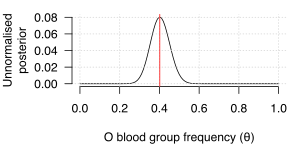
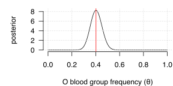
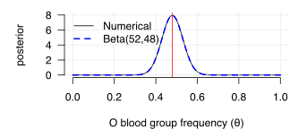
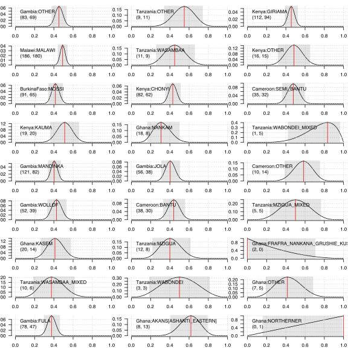

## The frequency of O blood group

In this section we will estimate the frequency of O blood group (as encoded by the [common
loss-of-function deletion in the ABO
gene](https://www.ensembl.org/Homo_sapiens/Variation/Explore?v=rs8176719), in multiple populations.

### An aside on the ABO blood group system.

The ABO blood group system was the first genetic polymorphism discovered in humans - [long before
the structure of DNA was solved](https://www.ncbi.nlm.nih.gov/books/NBK2267/). It was discovered by
studying agglutination patterns of red cells in serum from other individuals and is of course of
extreme relevance to blood transfusion. Beyond this, however, ABO is an interesting gene; the A/B
split seems to have been preserved [under balancing
selection](https://www.pnas.org/content/109/45/18493) across primates, while the O mutation itself
may be a recurrent polymorphism. ABO is also [one of the most pleiotropic loci in the human
genome](https://www.ncbi.nlm.nih.gov/pmc/articles/PMC5207801/) and there is evidence it is
[associated with risk of SARS-CoV-2
infection](https://www.ncbi.nlm.nih.gov/pmc/articles/PMC7594382/). 

But I was interested because it is also [protective against
malaria](https://www.nature.com/articles/s41467-019-13480-z). (The data here comes from that paper).

### Loading the data
First, let's load the data.

**Note.** I am using the [tidyverse](https://www.tidyverse.org) for these examples. If you don't
have it installed, either install it or use base R (e.g. `read.csv()`) instead.

```
library( tidyverse )
data = read_csv( "o_bld_grp.csv" )
```

**Question**.  What countries are in the data?  What ethnic groups?

The O blood group data is in the column called `O.bld.grp`. A `1` in this column means the
individual has O blood group (which happens if they have two copies of the above rs8176719
deletion). A `0` generally means they will have either A, AB, or B blood group depending on the
alleles they carry. (There are actually a few other mutations that cause loss of function of `ABO`,
but we're ignoring them here.)

**Question**. Table this data for each population or ethnicity. Can you estimate the frequency in
each population? In each ethnic group?


### Building a model

You probably estimated the allele frequency as: the number of O individuals divided by the total
number of individuals.  If so good - that's a sensible estimate!

But hang on...

**Question.** How much do you trust these estimates? Do you trust them all as much as each other?  Why?

This course is all about handling uncertainty. We want to know, not just what a good estimate is, but also how
uncertain we are about that estimate.  This is what statistical models are for.

Let's focus on a single population first - say Tanzania:

```
w = which( data$country == "Tanzania" )
> table( data$country[w], data$O.bld.grp[w] )
          
            0  1
  Tanzania 51 47
```

Counts like this can be modelled well using a [binomial distribution](../../notes/Distributions%20cheatsheet.pdf).

**Question**. If we use a binomial distribution to model these counts, what assumptions are we making?

The binomial distribution takes two parameters: `n`, the number of 'trials' (i.e. samples), and *&theta;*, the
frequency. (&theta; is called *p* on the [probability cheatsheet](../../notes/Probability cheatsheet.pdf), but we'll
call it &theta; here.)

The data is *k* - the number of O blood group alleles observed. Our conceptual model is that the population 'emits' O
blood group alleles at frequency &theta;. It is this frequency that we want to infer.

The basic inference formula (Bayes rule) is:


For the moment let us ignore the prior term *P(&theta;=x)*. (This is the same as assuming it is uniform).

The term P(data|&theta;=x) is our *likelihood function*. This is what we will model with a binomial distribution. That
is, we will assume:


**Note.** As in the [probability cheatsheet](../../notes/Probability%20cheatsheet.pdf) you must remember that all
probability is conditional. In all probabilities above we are assuming this *highly unrealistic* but *hopefully useful*
model in which a single frequency parameter governs O blood group in an entire human population. The probabilities
don't exist in the real world, but only in the model.

### Plotting the unnormalised posterior

**Question.** Given the counts for Tanzania above, plot the unnormalised posterior of the parameter &theta;. Also add
on a line showing your point estimate.

**Note.** Because we are using a flat prior and the normalising constant here, this is the same as plotting the
likelihood function - the only R function you really need for this is `dbinom()`. For readability it can be nice to
make a friendlier function matching the notation above:

```
binomial.likelihood <- function( k, n, theta ) {
    return( dbinom( x = k, size = n, prob = theta ) )
}
```

When you plot this you should see something like this:



**Note.** You did label your axes, right?  Hey, you must always label your axes!

**Question.** Can you make a grid of these plots, one per population?  One per ethnicity?

### Plotting the (normalised) posterior

In principle computing the fully normalised posterior is not hard. We just need to compute the denominator of Bayes
theorem above, which (using the *law of total probability* from the [probability cheatsheet](../../notes/Probability
cheatsheet.pdf)) is:


You could for example numerically could this using the `integrate()` function - e.g. using the Tanzania counts above:

```
f <- function( y ) { return( binomial.likelihood( 47, 98, y ) ) ; }
denominator = integrate( f, 0, 1 )$value
```

It we now plot the (normalised) posterior, it looks the same as the likelihood but the y axis scale is different:

```
plot_normalised_posterior <- function( k, n ) {
	f <- function( y ) { return( binomial.likelihood( k, n, y ) ) ; }
	denominator = integrate( f, 0, 1 )$value

	x = seq( from = 0, to = 1, by = 0.01 )
	plot(
		x, binomial.likelihood( k = k, n = n, theta = x ) / denominator,
		type = 'l',
		xlab = "O blood group frequency (θ)",
		ylab = "Normalised posterior",
		yaxt = 'n',
		bty = 'n'
	)
	grid()
	abline( v = k/n, col = 'red' )
	axis( 2, las = 1 )
}
plot_normalised_posterior( 51, 98 )
```


(If you stare at this a bit you'll see it looks about right in terms of the total mass under the function - which
should sum to 1).

### A Beta way to do it

In the general case solving the denominator can indeed be hard and require numerical integration like the above.
However, for this binomial model it turns out to be much easier. This is because the binomial has a 'conjugate' family of prior
distributions - the [Beta distribution](../../notes/Distributions%20cheatsheet.pdf).

If you stare at the Beta and binomial distributions [on the cheatsheet](../../notes/Distributions%20cheatsheet.pdf)
you'll see why this works. Using our notation here, the parameter &theta; (called *p* on the cheatsheet) enters the
binomial distribution pdf in the term:


on the other hand, the frequency parameter of the Beta distribution (called *x*) on the cheatsheet) enters its pdf in the
similar term:


All the other terms are constant as far as the frequency parameter is concerned. What all this means is that **for a uniform (or
Beta) prior, and a binomial likelihood, the posterior distribution is a Beta distribution**:


This relationship between prior and likelihood is known as 'conjugacy' - we say the Beta prior is conjugate to the Binomial
likelihood.

We can prove this for our data by adding it to our plot:

```
x = seq( from = 0, to = 1, by = 0.01 )
points( x, dbeta( x, shape1 = 51+1, shape2 = 47+1 ), type = 'l', lty = 2, col = 'blue' )
```



### Comparing estimates

Having this analytical version of the posterior is good news. Here are two ways it helps. 

1. it makes it easy to make some quantitative statements about our parameter.

For example, we could summarise our inference by computing a **credible interval** for our parameter. A good interval
to take is a 95% posterior mass interavls, which you can form by chopping of 2.5% of the mass from both tails of the
distribution. If you want to see how to do this, look at the diagram [on the probability
cheatsheet](../../notes/Distributions%20cheatsheet.pdf). In R, the beta cdf is given by `pbeta()`, and its inverse (the
quantile function) by `qbeta()`. So we can do something like this:

```
compute.credible.interval <- function( k, n, mass = 0.95 ) {
	tail = 1-mass
	return( qbeta(
        c(
            lower = tail/2,
            median = 0.5,
            upper = 1.0-(tail/2)
        ),
        shape1 = k+1,
        shape2 = n-k+1
    ))
}
```

And let's use it to make a function to easily summarise any given subset of the data:
```
compute.counts <- function( data ) {
	return( c(
		nonO = length( which( data$O.bld.grp == 0 )),
		O = length( which( data$O.bld.grp == 1 ))
	))
}
summarise <- function( data.subset, name ) {
	counts = compute.counts( data.subset )
	credible = compute.credible.interval( counts[2], sum(counts ))
	return( c(
		list( name = name, nonO = counts[1], O = counts[2], estimate = counts[2]/sum(counts) ),
		credible
	))
}
```

**Question** Compute the 95% credible interval for all the populations. Compare to the sample size. (For example - can
you plot sample size vs size of credible interval?). What is the pattern?

**Question.** Do all the 95% credible intervals overlap? What about for individual ethnicities?

**Hint.** A neat way to do this is to use `map_dfr()` from the [purr package](https://github.com/rstudio/cheatsheets/blob/main/purrr.pdf):

```
countries = unique( data$country )
map_dfr( countries, function(country) { summarise( data[ data$country == country, ], country ) })

data$country_ethnicity = sprintf( "%s:%s", data$country, data$ethnicity )
ethnicities = unique( data$country_ethnicity )
map_dfr( ethnicities, function(ethnicity) { summarise( data[ data$country_ethnicity == ethnicity, ], ethnicity ) })
```

We could also add these to our plots:




Another way the conjugate prior / analytical formulation helps is:

2. It lets us deal with  very uncertain estimates.

If you look at some ethnic groups, they have small counts and fairly uncertain estimates - and in some cases the point
estimates are quite different to those from other populations. For example - the `AKANS[ASHANTI_EASTERN]` which has
only 21 individuals, and has a point estimate of > 0.6 even though most of the others are < 0.8. Is O blood group
really at such high frequency in those populations?

Or what about the `FRAFRA_NANKANA_GRUSHIE_KUSASI[UER]` or other ethnicities where the point estimate is zero? Clearly
we shouldn't believe there are no O blood group individuals in those groups based on these data.

One way to deal with this is simply to look at our posterior.  For these populations it says:

However, it is often useful to get a sensible point estimate even when there isn't much data. Our framework above
allows us to do this. Specifically, let's 


### Going further

If you've followed 


If you follow the above through you'll see that:

* Starting with a flat (uniform) prior distribution, and adding some data, we end up with a beta posterior.
* If we start with a beta posterior 

## A note on binomial assumptions

Above I asked what assumptions we make in choosing a binomial distribution. We are making quite a few:

* We are assuming that the total number of samples (e.g. 98 in the case of Tanzania) was known beforehand. (This could
  be violated by sampling. For example this would be violated if we had chosen to up-sample ethnic groups with higher O
  blood group frequency.)
  
* We are assuming that the data points from different individuals can be treated as independent. (This assumption would
  be violated, for example, if we sampled within families, since they share DNA.)


